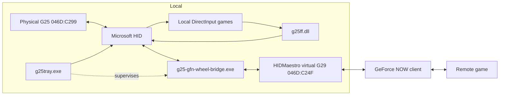

# GeForce NOW bridge as an optional component

Status: design. Branch `feature/geforce-now-wheel-support`.

This document plans how the GeForce NOW wheel bridge relates to this project.
Background on *why* a bridge is needed is in `geforce-now.md`.

## Decision

The bridge ships as an **optional companion component**, not as part of the
default driver.

- Source of truth: the standalone repo `g25-gfn-wheel-bridge`
  (`feature/cleanup-and-plugin-prep`). The older `tools/gfn-g25-bridge-poc/`
  proof of concept in this repo is superseded and should be removed.
- It is a separate executable (`g25-gfn-wheel-bridge.exe`, .NET 10), separately
  versioned, launched and supervised by `g25tray.exe`.
- It is **not installed by default**. The installer offers it as an unchecked
  feature with its own consent screen.

### Why not fold it in

| | g25-driver | GFN bridge |
| --- | --- | --- |
| Toolchain | C++20 / CMake | .NET 10 |
| Runtime deps | none | HIDMaestro.Core.dll (~40 MB), .NET runtime, WinRT |
| Privileges | per-user, never admin | admin + installs a UMDF2 virtual HID driver (self-signed test cert) |
| Maturity | hardware-validated | prototype, FFB unverified |

The driver's headline guarantee is "no kernel driver, no admin, no signature
bypass, pure per-user". A default-on GFN mode that installs a virtual HID driver
breaks that guarantee for every user, including those who will never use GFN.
Keeping it as an opt-in companion preserves the guarantee and lets the two
release on their own cadence.

"Plugin" here means product/UX (one tray, one installer, one project family),
not an in-process DLL loaded by the driver.

## Architecture

`g25ff.dll` and the bridge never run against the same wheel handle at the same
time in practice: GFN does not load local DirectInput effect drivers, and local
DirectInput games do not talk to the virtual G29. The tray still serializes HID
output access with the existing local mutex.

## Shared protocol library

`G25Source.cs` and `G25ForceFeedbackRelay.cs` in the bridge duplicate logic this
repo already owns:

| Bridge code | This repo | 
| --- | --- |
| `G25Source` HID input decode | `src/protocol/logitech_protocol.*` `decode_windows_input`, `InputState` |
| `G25ForceFeedbackRelay` command bytes | `src/protocol/logitech_protocol.*` `windows_output`, `stop_all`, `disable_autocenter`, `native_mode`, `set_range` |
| (missing) virtual-G29 report -> G25 command translation | `src/protocol/force_feedback.*` + `src/directinput/effect_math.*` |

Plan:

1. Carve `src/protocol/` (plus the parts of `src/device/` that are pure decode)
   into a standalone static/shared library target, `libg25`, with a stable C
   ABI header (`libg25.h`). No CMake-wide behaviour change; `g25tool`, `g25ff`
   and `g25tray` link it as they do the sources today.
2. Add a build artifact `libg25.dll` (C ABI) for consumers outside the C++ tree.
3. The bridge calls `libg25.dll` through a thin P/Invoke wrapper for input decode
   and for FFB translation. It stops hand-maintaining the byte layout.
4. The FFB translation table (virtual G29 classic/extended reports -> G25
   commands) is implemented once, in `libg25`, and covered by the existing
   vector tests under `tests/`.

Until `libg25` exists: the bridge keeps its hand-written decode and marks any
drift against `docs/protocol.md` in its own `CHANGELOG.md`.

## Tray <-> bridge contract

`g25tray.exe` gains a "GeForce NOW mode" menu item:

- Greyed with a tooltip ("optional component not installed") until the bridge
  payload is present.
- When enabled: `CreateProcess` the bridge with `bridge --install-driver` on
  first run, then `bridge` afterwards; show running state; on disable, signal
  stop and run `bridge cleanup`.
- Auto-detect: when the GeForce NOW client process appears and GFN mode is
  enabled, offer to start the bridge (setting, default prompt).

Bridge side (tracked in the bridge repo `docs/plugin-integration.md`):

- Stable CLI and exit codes (0 = clean stop, non-zero + one stderr line).
- `--json` for `inspect`.
- A status/control channel (named pipe `\\.\pipe\g25gfn-status`, newline JSON,
  accepts `stop`) so the tray does not scrape stdout.
- No UI of its own.

## Installer

- New optional feature "GeForce NOW bridge (advanced)", unchecked by default.
- Its own page: explains it installs a virtual HID driver (HIDMaestro, UMDF2,
  self-signed test certificate) and needs Administrator once.
- Install: copy the bridge payload next to `g25tray.exe`, register the
  HIDMaestro driver.
- Uninstall / feature-disable: `bridge cleanup`, then remove the HIDMaestro
  driver, then remove the payload. The core driver uninstall path is unchanged.
- CI: a second job builds the .NET bridge; release bundles it as a separate
  asset and inside the installer's optional feature.

## Open questions

1. **FFB translation.** Captured virtual-G29 output reports are Logitech
   command-format with zero payloads so far; no real force confirmed. Needs a
   capture with a deliberate in-game force. See the bridge's
   `docs/ffb-protocol.md`.
2. **G HUB dependency.** NVIDIA requires "G HUB running". G HUB claims the
   virtual G29. Does output-report traffic survive with G HUB removed? Test in
   progress (`docs/geforce-now.md`, "G HUB dependency test").
3. **Licensing.** If `libg25` (GPL-2.0-only) is linked into the bridge, the
   bridge's own license must be GPL-compatible. Currently undecided; the bridge
   repo has no LICENSE yet.
4. **G27 and others.** The bridge's profile system already generalizes; the
   shared library identifies G25/G27/G29. Generalizing is a later milestone.
