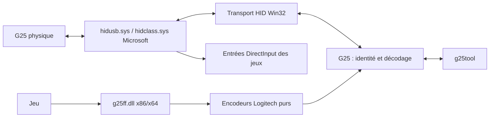
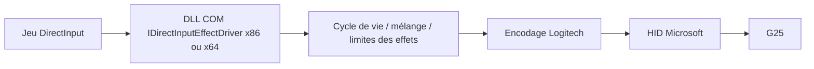

# Architecture Windows

Architecture mise en œuvre au 7 septembre 2026 : prototype utilisateur C++20,
CMake, API natives Windows, aucune dépendance runtime tierce obligatoire et
aucun pilote noyau ajouté. Les jalons matériels et la DLL DirectInput initiale
sont décrits dans validation.md.

## Chemin retenu pour le prototype

`SetupDiGetClassDevs` + `GUID_DEVINTERFACE_HID` énumèrent les collections.
`CreateFileW` ouvre un handle partagé, sans remplacement du pilote HID.
`HidD_GetAttributes`, `HidD_GetPreparsedData`, `HidP_GetCaps` et les capacités
de valeurs/boutons décrivent le périphérique. Les accès lecture et écriture
sont demandés uniquement pour les commandes qui en ont besoin.
`ReadFile`/`WriteFile` overlapped permettent attente, annulation et détection
des déconnexions. RAII possède handles et données préparsées.

Les [buffers HID doivent avoir le Report ID en tête][reports], y compris zéro
sans identifiant explicite. `OutputReportByteLength` fixe la taille Windows.
Microsoft recommande [WriteFile pour les sorties continues][send] ;
`HidD_SetOutputReport` n'est pas universellement supporté. Le prototype ne
devine pas un autre canal après échec. Une erreur indique l'opération, le code
Win32 et le chemin concerné. Les envois sont journalisés en hexadécimal.

## Ce que Windows peut exposer nativement

Le descripteur natif G25 indique joystick, axes X/Z/Rz/Y, POV et 19 boutons.
On s'attend donc à des entrées HID utilisables sans LGS, et à leur énumération
DirectInput. En mode de compatibilité, le descripteur et les commandes
accessibles diffèrent ; l'embrayage et certains rapports peuvent manquer.
C'est une attente fondée sur le descripteur, pas un constat sur ce PC : aucun
G25 présent n'a été trouvé pendant l'analyse initiale.

`info` fournit les tailles, usages et domaines HID réellement retournés, puis
un inventaire DirectInput avec axes/boutons/POV et indicateur `DIDC_FORCEFEEDBACK`.
Cet inventaire sert à distinguer ce que le système annonce de ce que nous
déduisons. Il ne joue aucun effet et ne garantit pas que les fonctions
annoncées par un ancien composant installé fonctionnent. Sur un PC sans LGS,
conserver le résultat avant toute intégration FFB pour servir de référence.

Le rapport de sortie G25 est propriétaire (page `FF00`), pas un descripteur
FFB HID PID complet. Envoyer les commandes Logitech en userspace **ne suffit
pas** à faire apparaître spontanément le volant comme FFB dans DirectInput.
L'architecture doit aussi recevoir les requêtes des jeux.

## Intégration aux jeux

### DLL d'effets DirectInput retenue

Microsoft documente [IDirectInputEffectDriver][effectdriver] et
[DIHIDFFINITINFO][hidinit], qui fournit l'identité du HID à une implémentation
de pilote d'effets. Cela permet d'étudier une DLL COM utilisateur x86 et x64,
enregistrée avec les capacités OEM Force Feedback du joystick physique.

Ce chemin réutilise les entrées du volant physique et évite un pilote virtuel.
`g25ff.dll` implémente `IDirectInputEffectDriver` dans les architectures x86
et x64. Un enregistrement OEM/COM par utilisateur associe le G25 natif
`046d:c299` aux douze effets standard DirectInput. La simple interrogation des capacités
n'ouvre pas le volant en écriture ; la sortie HID est acquise au premier ordre
FFB. Une mutex locale exclut alors les écritures concurrentes de `g25tool`.

Sur le poste d'essai, DirectInput x86 et x64 annoncent quatre axes, 19 boutons,
un POV, `DIDC_FORCEFEEDBACK=yes` et les 12 GUID standard : Constant, Ramp,
Square, Sine, Triangle, Sawtooth Up/Down, Spring, Damper, Inertia, Friction et
Custom. Les appels `CreateEffect`/`Start` ont produit les rapports HID attendus
pour les 12 effets, suivis de l'arrêt du slot et du nettoyage global. Cela
valide la chaîne technique jusqu'au G25 ; la sensation physique des nouveaux
effets et la compatibilité avec d'autres jeux doivent encore être consignées.

`DownloadEffect`, `StartEffect`, `StopEffect`, `DestroyEffect`, `SetGain`,
pause/reset/actuateurs et statut sont explicites. Les durées DirectInput en
microsecondes, répétitions, délais, directions, gains et enveloppes sont
convertis par un worker. Les constantes actives sont additionnées et bornées.
Ramp, les cinq formes périodiques et Custom sont synthétisés toutes les 4 ms,
puis mélangés dans le slot constant. Spring utilise son slot matériel. Damper
et Inertia partagent le slot damper, où l'effet actif le plus fort est retenu.
Friction utilise le quatrième slot matériel.

Le script `scripts/Register-G25FF.ps1` copie les deux DLL dans
`%LOCALAPPDATA%\g25ff\bin`, sauvegarde les clés présentes et enregistre les
vues COM 32/64 bits. La désinstallation retire ces clés et restaure les
sauvegardes. Cette modification userspace du registre ne requiert ni INF, ni
élévation, ni signature de pilote.

`g25tray.exe` est une application distincte, lancée au login de l'utilisateur.
La DLL reste autonome dans chaque jeu. L'application attend les notifications
de connexion Windows ; elle ne sonde pas continuellement le HID. Lorsqu'un G25
reconnu revient en mode de compatibilité, elle envoie la bascule native, attend
la réénumération puis applique la rotation mémorisée (180°, 360°, 540° ou 900°).
Elle ne limite pas le gain FFB, qui reste sous le contrôle du jeu.
La détection et les sorties FFB dépendent uniquement de la base du volant :
ni le pédalier ni le shifter ne sont requis. Leurs usages restent présents dans
le descripteur HID fixe lorsque les accessoires sont absents.

### Option de repli : volant virtuel existant

| Solution étudiée | Intérêt | Limite / état de validation |
| --- | --- | --- |
| [vJoy, fork BrunnerInnovation][vjoy] | Joystick virtuel, SDK de publication des axes et réception FFB ; correspond au chemin demandé | Contient un pilote kernel. Candidat seulement : il faut sélectionner et vérifier un binaire signé précis, puis tester HVCI + Secure Boot sur Windows cible. Aucune certification de compatibilité n'est déduite du README ou d'un numéro de version. |
| [ViGEmBus][vigem] | Bus virtuel existant pour manettes Xbox 360 / DS4 | Dépôt archivé ; sorties de vibration de manette, pas un backend de volant DirectInput avec spring/damper. Non retenu. |
| [Virtual HID Framework Microsoft][vhf] | Construction de HID virtuels | La documentation exige un source driver kernel KMDF/WDM ; ce n'est pas une API d'injection purement userspace. Hors prototype. |

Avec vJoy : jeu → DirectInput FFB → pilote virtuel → callback SDK vers
userspace → moteur d'effets → sorties G25. Les entrées font le chemin G25 →
service → SDK → périphérique virtuel. Il faut traiter les doublons de
contrôleurs visibles et les pertes de connexion. Un éventuel filtre de
masquage serait encore un composant à installer/évaluer ; il n'est pas requis
pour essayer le vrai G25 et n'est pas ajouté ici.

## Sécurité Windows

Le CLI utilise les pilotes HID déjà installés. Le script DirectInput effectue
uniquement l'enregistrement COM/OEM par utilisateur décrit ci-dessus. Aucun
composant n'effectue d'installation de pilote, élévation automatique ou modification
de Secure Boot, HVCI/Memory Integrity ou Driver Signature Enforcement.
WinUSB/Zadig n'est pas utilisé. Ces protections n'empêchent pas par principe
une application normale d'accéder à une collection joystick HID.

Pour un futur backend kernel, signature acceptée par Windows et
[compatibilité HVCI][hvci] sont deux exigences distinctes. Un certificat de
test ou une simple signature d'éditeur ne démontre pas une compatibilité
Windows 11 en configuration protégée. Avant adoption : vérifier le catalogue
et la provenance du paquet, l'installation sur le système cible avec ses
protections actives, les événements Code Integrity, puis entrées et effets.
Si aucun backend ne passe ces vérifications, arrêter cette voie et exposer
le blocage au lieu de proposer de désactiver une protection.

## Modules et étapes petites

1. **Analyse** : protocole sourcé, limites de réutilisation, architecture.
2. **Socle** : CMake C++20, encodeurs/décodeur portables, tests de vecteurs
   indépendants du matériel ; compiler avant d'ajouter le transport.
3. **Jalon 1** : énumération HID, `list`, `info`, `monitor` ; capacité réelle,
   lecture bornée et Ctrl+C ; compiler puis inventorier le PC.
4. **Jalon 2** : `native` explicite si nécessaire et `range 40..900` ; protéger
   l'identification et le choix du périphérique ; `--dry-run` pour inspecter
   les rapports sans ouvrir le matériel ; compiler et tester les erreurs.
5. **Jalon 3** : session FFB avec garde d'arrêt, force constante très faible
   pendant une seconde ; spring/damper faibles ; tests d'arrêt/erreur sur faux
   transport, jamais de moteur dans les tests automatiques.
6. **Validation matérielle** : relevés sans LGS, mouvement de chaque entrée,
   butées 540/900, faibles effets puis arrêt et déconnexion. Aucun jalon
   matériel n'est déclaré atteint sur la seule base d'une compilation.
7. **Jeux** : DLL DirectInput x86/x64 réalisée pour les 12 effets standard ;
   chaîne validée dans un jeu et transferts des nouveaux effets vérifiés sur le
   matériel. Poursuivre les essais de sensation et de compatibilité par jeu.

Arborescence : `src/protocol` (pur, testable), `src/device` (Win32 + garde
d'arrêt), `src/app` (CLI et signal console). `virtual_device` sera ajouté
seulement avec un backend effectif ; aucun faux périphérique n'est annoncé.

Difficultés principales : PID partagé et réénumération, variantes de
descripteur, accès concurrent HID, correspondance des rapports de boîte,
absence de lecture de plage et de watchdog démontré, puis intégration COM
DirectInput et comportement des jeux. Elles sont des points de validation,
pas des prétextes pour remplacer le pilote HID standard.

[reports]: https://learn.microsoft.com/en-us/windows-hardware/drivers/hid/initializing-hid-reports
[send]: https://learn.microsoft.com/en-us/windows-hardware/drivers/hid/sending-hid-reports
[effectdriver]: https://learn.microsoft.com/en-us/windows/win32/api/dinputd/nn-dinputd-idirectinputeffectdriver
[hidinit]: https://learn.microsoft.com/en-us/windows/win32/api/dinputd/ns-dinputd-dihidffinitinfo
[vjoy]: https://github.com/BrunnerInnovation/vJoy
[vigem]: https://github.com/nefarius/ViGEmBus
[vhf]: https://learn.microsoft.com/en-us/windows-hardware/drivers/hid/virtual-hid-framework--vhf-
[hvci]: https://learn.microsoft.com/en-us/windows-hardware/test/hlk/testref/driver-compatibility-with-device-guard
