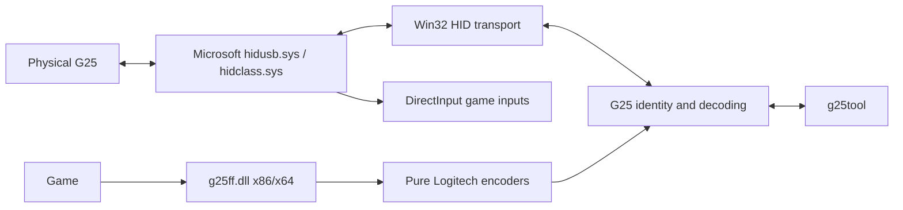
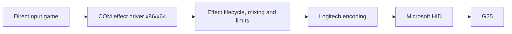

# Windows Architecture

Architecture as of 7 September 2026: user-mode C++20 prototype, CMake, native
Windows APIs, no required third-party runtime dependency, and no added kernel
driver. Hardware milestones and DirectInput validation are recorded in
`docs/validation.md`.

## Chosen Prototype Path

`SetupDiGetClassDevs` plus `GUID_DEVINTERFACE_HID` enumerate HID collections.
`CreateFileW` opens a shared handle without replacing the HID driver.
`HidD_GetAttributes`, `HidD_GetPreparsedData`, `HidP_GetCaps` and HID value /
button capabilities describe the device. Read and write access are requested
only for commands that need them.

`ReadFile`/`WriteFile` with overlapped I/O provide bounded waits, cancellation
and disconnect detection. RAII owns handles and preparsed data.

Windows HID buffers include the Report ID as the first byte, including `00`
when the descriptor has no explicit Report ID. `OutputReportByteLength`
determines the exact Windows buffer length. The prototype uses `WriteFile` for
continuous output reports and does not guess another output channel after a
failure.

## Native Windows Exposure

The native G25 descriptor exposes a joystick, axes X/Z/Rz/Y, one POV and 19
buttons. That should make normal inputs visible without LGS. Compatibility mode
descriptors expose a different layout, where clutch or some shifter information
may be missing.

`g25tool info` prints HID report sizes/usages and a DirectInput inventory with
axes, buttons, POV and `DIDC_FORCEFEEDBACK`. It is a diagnostic command and does
not play effects.

The G25 output report is vendor-specific (`FF00` page), not a full HID PID FFB
descriptor. Sending Logitech commands from user mode is not enough to make
DirectInput games discover FFB. Games also need a DirectInput effect driver.

## DirectInput Effect Driver

Microsoft documents `IDirectInputEffectDriver` and `DIHIDFFINITINFO`, which
allow a user-mode COM DLL to receive effect requests for a physical HID device
registered through OEM Force Feedback registry keys.

This path reuses the physical wheel inputs and avoids a virtual wheel driver.
`g25ff.dll` implements `IDirectInputEffectDriver` for x86 and x64. A per-user
OEM/COM registration associates native G25 `046d:c299` with the 12 standard
DirectInput effects.

Capability queries do not open the wheel for writing. The HID output path is
acquired when the first FFB command needs to be sent. A local mutex excludes
concurrent writes from `g25tool`.

On the test machine, DirectInput x86 and x64 report four axes, 19 buttons, one
POV, `DIDC_FORCEFEEDBACK=yes`, and all 12 standard effect GUIDs: Constant, Ramp,
Square, Sine, Triangle, Sawtooth Up/Down, Spring, Damper, Inertia, Friction and
Custom. `CreateEffect`/`Start` produced the expected HID reports for all 12
effects, followed by slot stop and global cleanup.

`DownloadEffect`, `StartEffect`, `StopEffect`, `DestroyEffect`, `SetGain`,
pause/reset/actuator state and status are explicit. DirectInput durations,
repetitions, delays, directions, gains and envelopes are converted by a worker.
Active constants are summed and clamped. Ramp, periodic effects and Custom are
synthesized every 4 ms and mixed into the constant-force slot. Spring uses its
hardware slot. Damper and Inertia share the damper slot, keeping the strongest
active effect. Friction uses the fourth hardware slot.

## Registration And Tray Helper

`scripts/Register-G25FF.ps1` copies both DLLs to `%LOCALAPPDATA%\g25ff\bin`,
backs up existing per-user registry keys and registers 32-bit and 64-bit COM
views. Uninstall removes the keys and restores backups. This is a user-mode
registry integration and does not need an INF, elevation or driver signature.

`g25tray.exe` is a separate application launched at user sign-in. The DLL stays
autonomous inside each game process. The tray app waits for Windows device
notifications and does not continuously poll HID. When a recognized G25 appears
in compatibility mode, it sends the native-mode switch, waits for
re-enumeration, waits briefly for firmware calibration to settle, applies the
saved steering range (180, 360, 540 or 900 degrees), then stops effects and
disables autocenter so the motors are released.

The tray app does not limit FFB gain; games remain responsible for that. G25
base detection and FFB output do not require pedals or shifter. Their usages
remain present in the fixed HID descriptor when accessories are absent.

## Virtual Wheel Fallback Considered

| Option | Interest | Limit / Validation State |
| --- | --- | --- |
| [vJoy, BrunnerInnovation fork][vjoy] | Existing virtual joystick plus SDK, possible FFB callback path | Contains a kernel driver. Would require verification of signed binaries, HVCI and Secure Boot behavior before adoption. |
| [ViGEmBus][vigem] | Existing virtual bus for Xbox 360 / DS4 pads | Archived project; gamepad rumble only, not a DirectInput wheel FFB backend. |
| [Microsoft Virtual HID Framework][vhf] | Build virtual HID devices | Requires a KMDF/WDM kernel source driver; not a pure user-mode injection API. |

The virtual path remains unnecessary for the current prototype because the
physical G25 inputs are already visible and DirectInput FFB can be associated
with the real HID device.

## Windows Security

The CLI uses the existing Microsoft HID drivers. The DirectInput integration
performs only the per-user COM/OEM registration described above. No component
installs a driver, elevates automatically, modifies Secure Boot, modifies
HVCI/Memory Integrity or disables Driver Signature Enforcement. WinUSB/Zadig is
not used.

For any future kernel backend, accepted Windows signing and [HVCI
compatibility][hvci] are separate requirements. A test certificate or simple
publisher signature would not prove Windows 11 compatibility on a protected
system.

## Incremental Milestones

1. Protocol analysis, reuse boundaries and architecture.
2. CMake C++20 base, pure encoders/decoder and vector tests.
3. HID enumeration, `list`, `info`, `monitor`, bounded reads and Ctrl+C.
4. Explicit native-mode switch and 40-900 degree range command.
5. Bounded FFB output sessions with stop guards.
6. Hardware validation: input movement, stops, weak effects, stop and USB
   disconnect behavior.
7. Game integration through a DirectInput effect driver for the 12 standard
   effects.

Main risks to keep visible: shared PID/re-enumeration, descriptor variations,
concurrent HID output access, shifter mapping, lack of range readback, lack of a
proven hardware watchdog, and game-specific DirectInput behavior.

[vjoy]: https://github.com/BrunnerInnovation/vJoy
[vigem]: https://github.com/nefarius/ViGEmBus
[vhf]: https://learn.microsoft.com/en-us/windows-hardware/drivers/hid/virtual-hid-framework--vhf-
[hvci]: https://learn.microsoft.com/en-us/windows-hardware/test/hlk/testref/driver-compatibility-with-device-guard
